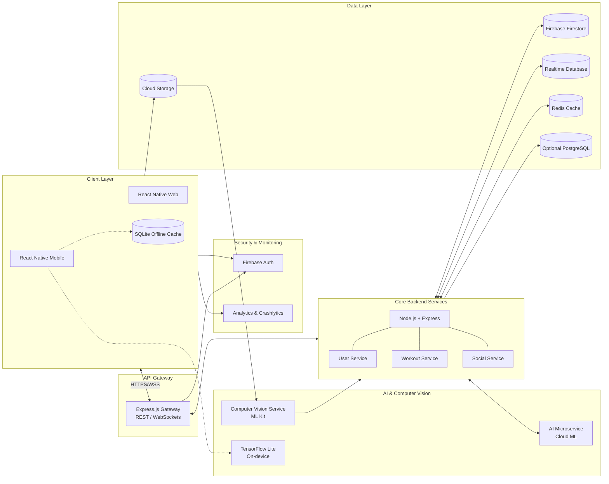

# Architecture Diagram

```mermaid
flowchart LR
    %% Client Layer
    subgraph ClientLayer [Client Layer]
        MobileApp[React Native Mobile]
        WebApp[React Native Web]
        SQLite[(SQLite Offline Cache)]
        MobileApp -.-> SQLite
    end

    %% Edge Services
    subgraph EdgeServices [Security & Monitoring]
        FirebaseAuth[Firebase Auth]
        FirebaseAnalytics[Analytics & Crashlytics]
    end

    %% API Layer
    subgraph APILayer [API Gateway]
        ExpressGateway[Express.js Gateway\nREST / WebSockets]
    end

    %% Core Services
    subgraph CoreBackend [Core Backend Services]
        NodeApp[Node.js + Express]
        Users[User Service]
        Workouts[Workout Service]
        Social[Social Service]
        
        NodeApp --- Users
        NodeApp --- Workouts
        NodeApp --- Social
    end

    %% AI & CV Services
    subgraph AIServices [AI & Computer Vision]
        AIMicroservice[AI Microservice\nCloud ML]
        CVService[Computer Vision Service\nML Kit]
        TFLite[TensorFlow Lite\nOn-device]
    end

    %% Data Layer
    subgraph DataLayer [Data Layer]
        Firestore[(Firebase Firestore)]
        RTDB[(Realtime Database)]
        Redis[(Redis Cache)]
        CloudStorage[(Cloud Storage)]
        PostgreSQL[(Optional PostgreSQL)]
    end

    %% Connections
    ClientLayer <-->|HTTPS/WSS| ExpressGateway
    ClientLayer --> FirebaseAuth
    ClientLayer --> FirebaseAnalytics
    MobileApp -.-> TFLite

    ExpressGateway --> FirebaseAuth
    ExpressGateway <--> CoreBackend

    CoreBackend <--> Redis
    CoreBackend <--> Firestore
    CoreBackend <--> RTDB
    CoreBackend --> PostgreSQL

    %% AI Integration
    CoreBackend <--> AIMicroservice
    
    %% Nutrition flow
    ClientLayer --> CloudStorage
    CloudStorage --> CVService
    CVService --> CoreBackend
```
